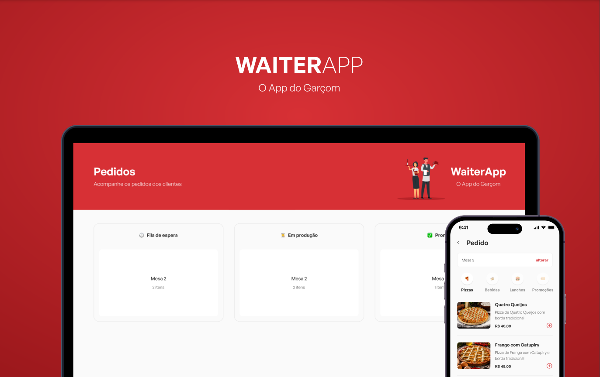

<h1 align="center">
  <br>
  <a></a>
  <br>
  WaiterApp - O App do Garçom
  <br>
</h1>

<h4 align="center">Um aplicativo web e mobile com uma API de integração.</h4>

<p align="center">
	
	  
	
		
</p>


## Sobre

O Waiter App é uma solução abrangente e inovadora projetada para otimizar o fluxo de pedidos em restaurantes. Com essa aplicação de ponta, garçons e equipe da cozinha podem se manter conectados como nunca antes.

O projeto consiste em duas partes complementares: um aplicativo mobile e uma plataforma web. O aplicativo mobile foi especialmente desenvolvido para os garçons, proporcionando-lhes um menu digital intuitivo, no qual eles podem facilmente criar pedidos personalizados para os clientes, especificando a mesa em que estão sentados. A plataforma web, por sua vez, funciona como um painel de controle abrangente, exibindo o estado atual de cada pedido e fornecendo um ambiente centralizado para a equipe da cozinha gerenciar e monitorar as solicitações.

Tudo isso é possível graças à integração perfeita entre as duas interfaces, que é facilitada por meio de uma API eficiente. Essa API atua como um hub central, permitindo a transferência automática de dados entre o aplicativo mobile e a plataforma web. Dessa forma, a comunicação entre os garçons e a cozinha é agilizada, garantindo um serviço mais eficiente e uma experiência aprimorada para os clientes.

Além disso, a plataforma web oferece uma visão completa do estado de cada pedido, permitindo que a equipe da cozinha acompanhe o progresso de cada solicitação em tempo real. Os pedidos são categorizados em três estados distintos: "Fila de Espera", indicando que o pedido foi recebido e está aguardando preparo; "Em Produção", indicando que a equipe da cozinha está atualmente preparando o pedido; e "Pronto", indicando que o pedido está finalizado e pronto para ser entregue ao cliente.

Com o Waiter App, o restaurante se beneficia de uma solução completa e eficaz para o gerenciamento de pedidos, garantindo uma comunicação fluída e uma coordenação perfeita entre garçons e equipe da cozinha. Essa abordagem inovadora traz melhorias significativas em termos de eficiência operacional, redução de erros e satisfação geral dos clientes.


## Plataformas
  - WEB, Android e IOS.

## Como usar

### Pré-requisitos
Antes de começar, você vai precisar ter instalado em sua máquina as seguintes ferramentas: Git, Node.js,Expo e/ou Yarn, MongoDB Além disto é bom ter um editor para trabalhar com o código como VSCode.

```bash
# Clone esse repositório:
$ git clone https://github.com/lsouza32/WAITERAPP

# Entre no diretório:
$ cd WAITERAPP

# Em cada diretório do projeto (API, frontEnd, mobile) instale as dependências:
$ yarn install

# Nos diretório do projeto inicie as aplicações:

# API
$ cd API
$ yarn install
$ yarn start

# Front-end
$ cd frontEnd
$ yarn install
$ yarn dev

# Mobile
$ cd mobile
$ yarn install
$ expo start
```

### Atenção:, caso nao aparecer as imagens no app mobile, fique atento aos endereços da imagens presentes nos arquivos:
/mobile/src/components/Cart/index.tsx (linha 66)
/mobile/src/components/Menu/index.tsx (linha 45)
/mobile/src/ProductModal/index.tsx (linha 40)
/mobile/src/utils/api.ts (linha 4)

## Ferramentas

Para o desenvolvimento do projeto foram usadas as seguintes tecnologias:

Front-end:
- [React](https://react.dev/)
- [React Native](https://reactnative.dev/)
- [Expo](https://expo.dev/)
- [Styled-Components](https://styled-components.com/)
- [TypeScript](https://www.typescriptlang.org/)

Back-end:
- [Node JS](https://nodejs.org/en)
- [Mongo DB](https://www.mongodb.com/)
- [Express.js](https://expressjs.com/pt-br/)

## Layout


